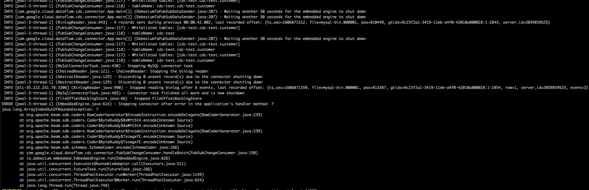
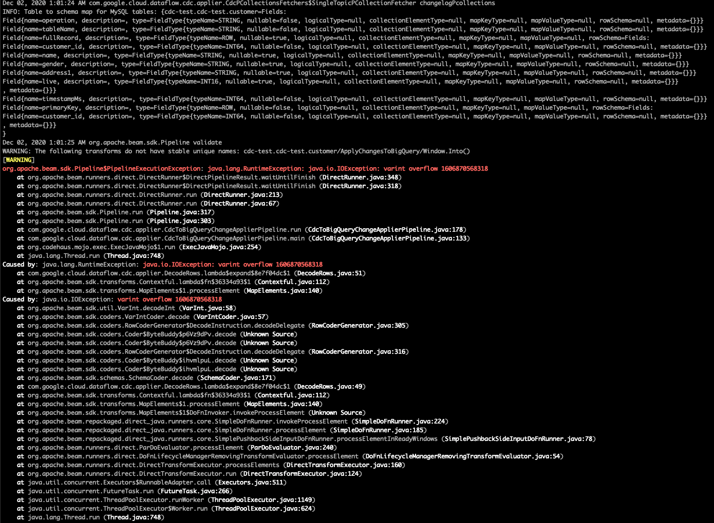
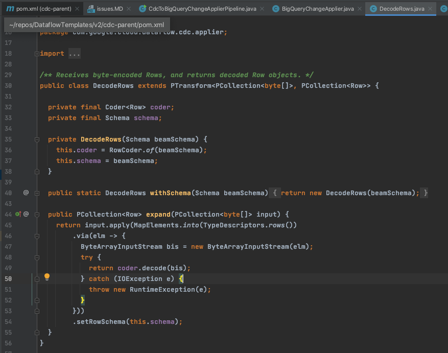

# Issues identified

## The Debezium Connector

### Out of bound index when adding column
When using version 0.9.5 final, if a new column is added, followed by a new insert using the new row, the connector breaks with an out of bound index error

This can be fixed by restarting the connector, the new table schema will then be re-scanned and the message will be successfully sent to PubSub.
If the deployment is done using K8 then the healthcheck will fail and a new pod will be created which should fix the issue automatically. 

## The CDC DataFlow Job

### variant overflow when adding column
When a new column is added in the source database, new PubSub messages will contain the new column which breaks the Dataflow pipeline with the `java.lang.RuntimeException: java.io.IOException: varint overflow` error. 
 

This cannot be resolved even by restarting the dataflow job, and I am not entirely sure why yet. It is surely related to the added column, and the Dataflow pipeline is not handling it correctly.

This might be where it broke. The beam schema is passed into the decoder, and if the schema does not match (in this case it won't) the message cannot be decoded
 

Possible solutions
1. (easier) Ignore unknown values - we can turn this on and ignore all new columns, this will lose data from the new columns but will allow the pipeline to continue
1. (hard) Allow streaming inserts to add new columns somehow (not sure if this works with the Record type which is what's in the changelog table), there might be issues on streaming inserts rejecting the new column when it's just added so needs verifying it works

 
## Progress of solving
Issues solved
- Old solution causes message to either fail to encode or decode because it uses the beam schema to encode the message before sending to pubsub. 
This is now changed to use base64 which gets around the schema encoding / decoding issue and the schema is always passed with the message itself
- Old solution always uses out of date schema when encoding / decoding data which not only breaks when there are schema changes but also can cause data corruption when column types are the same but out of order. 
This is now change to always use the latest schema when encoding & decoding but when inserting into BQ, only existing columns are used. This means as long as source table makes backwards compatible change, nothing will break but newly added column won't be insert into BigQuery. 